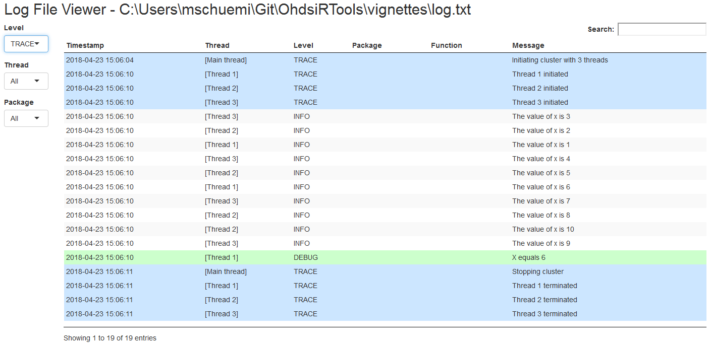

# Introduction

This vignette describes how you can use the `ParallelLogger` package to perform logging. Logging is the activity of recording events that occur during an analysis in a log. The log can be used for example for for debugging, profiling (understanding performance bottlenecks), and audits.

## Terminology

* **Logger**: An object that can receive **events**, and writes them to a log. A logger has a **name**, a prespecified **event level** (only events at or above that level are logged), and one or more **appenders**.
* **Event**: Consists of a message and an event level.
* **Event level**: Each event has an associated level. These levels (in ranked order) are 
  * `TRACE`: Events to mark the analysis has passed through some code.
  * `DEBUG`: Events to help understand the state of the code (e.g. whether a variable has a value).
  * `INFO`: Events typically displayed to the user to inform of the progress.
  * `WARN`: Events that indicate something probably requires attention.
  * `ERROR`: Events indicating something went wrong.
  * `FATAL`: Events indicating something went wrong, causing the analysis to terminate.
* **Appender**: An object that writes to a destination, for example the console or a file. An appender uses a **layout** to format its messages. There currently are three types of appenders:
  * **Console appender**: Writes to the console, created using the `createConsoleAppender` function.
  * **File appender**: Writes to a file, created using the `createFileAppender` function.
  * **E-mail appender**: Sends an e-mail, created using the `createEmailAppender` function.
* **Layout**: Objects specifying the format in which the log will be created. The following layouts are available:
  * `layoutSimple`: Only outputs the message. 
  * `layoutTimestamp`: Adds the current time and date to the message.
  * `layoutStackTrace`: Adds the time and date, and full stack trace to the message.
  * `layoutParallel`: Includes the thread identifier, name of the package and function raising the event, the current time and date, the message level, and the message itself.
  * `layoutErrorReport`: Creates a report for an event, including the message, stack trace, and information about the run-time environment such as the type of operating system, and installed R packages.
  * `layoutEmail`:  This layout adds the thread ID and stack trace to the message.

# Creating a console logger

The code below demonstrates how one would create a logger that writes  all events at level `INFO` or greater to the console using a layout with time stamp:

```{r, eval=FALSE}
logger <- createLogger(name = "SIMPLE",
                       threshold = "INFO",
                       appenders = list(createConsoleAppender(layout = layoutTimestamp)))

registerLogger(logger)

logTrace("This event is below the threshold (INFO)")

logInfo("Hello world")
```
```{r, echo=FALSE}
out <- "Hello world
2021-02-23 09:04:06 Hello world"
writeLines(out)
```


Note that the message is displayed twice. This is because there is a default logger that uses the simple layout and threshold = "INFO", and writes to console. We can remove this logger before registering our logger to avoid duplication:

```{r, eval=FALSE}
clearLoggers()

logger <- createLogger(name = "SIMPLE",
                       threshold = "INFO",
                       appenders = list(createConsoleAppender(layout = layoutTimestamp)))

registerLogger(logger)

logInfo("Hello world")
```
```{r, echo=FALSE}
writeLines("2021-02-23 09:04:06 Hello world")
```

## Shorthand 

A shorthand for creating a simple console logger is offered by the `addDefaultConsoleLogger` function. The code

```{r, eval=FALSE}
addDefaultConsoleLogger()
```

is equivalent to

```{r, eval=FALSE}
registerLogger(createLogger(name = "DEFAULT_CONSOLE_LOGGER",
                            threshold = "INFO", 
                            appenders = list(createConsoleAppender(layout = layoutSimple))))
```


# Creating a file logger

Probably more useful is a file logger. In the code below, we instantiate a logger that writes to file, using a threshold of `TRACE` (so including all events), and using the layout for parallel processing.

```{r, eval=FALSE}
logFileName <- "log.txt"

logger <- createLogger(name = "PARALLEL",
                       threshold = "TRACE",
                       appenders = list(createFileAppender(layout = layoutParallel,
                                                           fileName = logFileName)))
registerLogger(logger)

logTrace("Executed this line")

logDebug("There are ",  length(getLoggers()), " loggers")

logInfo("Hello world")
```
```{r, echo=FALSE}
writeLines("2021-02-23 09:04:06 Hello world")
```

We can read the log file:

```{r, eval=FALSE}
writeLines(readChar(logFileName, file.info(logFileName)$size))
```
```{r echo=FALSE}
out <- "2021-02-23 09:04:06\t[Main thread]\tTRACE\tevaluate\ttiming_fn\tExecuted this line
2021-02-23 09:04:06\t[Main thread]\tDEBUG\tevaluate\ttiming_fn\tThere are 2 loggers
2021-02-23 09:04:06\t[Main thread]\tINFO\tevaluate\ttiming_fn\tHello world"
writeLines(out)
```


And clean it up when we're done:

```{r, eval=FALSE}
unlink(logFileName)
```

## Shorthand 

A shorthand for creating the file logger detailed here is offered by the `addDefaultFileLogger` function. The code

```{r, eval=FALSE}
addDefaultFileLogger(logFileName)
```

is equivalent to

```{r, eval=FALSE}
registerLogger(createLogger(name = "DEFAULT_FILE_LOGGER",
                            threshold = "TRACE", 
                            appenders = list(createFileAppender(layout = layoutParallel, 
                                                                fileName = logFileName))))
```

# Creating an error report logger

A special case of a file logger is an error report logger. Rather than logging one event per row, the error report logger creates a single file dedicated to one event. As the name implies, this makes most sense for fatal error events. The error report contains the error message, stack trace, and information on the run-time environment, including the type of operating system and installed R packages. The idea is that this report can be shared between someone running the code and someone debugging the code remotely. 

The error report will be overwritten if a new error occurs, unless the new error occurs within 60 seconds of the creation of the error report. The reason for this delay is that it may be that a sub-thread throws an error, which we'd want to catch, followed shortly after by an error in the main thread, which we'd also like to catch. Both threads will then provide their error messages and stack trace, but only the main thread will include the information about the run-time environment, to avoid redundancy.

## Shorthand

It is recommended to simply always use the shorthand for creating an error report logger:

```{r, eval=FALSE}
addDefaultErrorReportLogger()
```

which is equivalent to

```{r, eval=FALSE}
fileName <- file.path(getwd(), "errorReportR.txt")

registerLogger(createLogger(name = "DEFAULT_ERRORREPORT_LOGGER",
                            threshold = "FATAL",
                            appenders = list(createFileAppender(layout = layoutErrorReport,
                                                                fileName = fileName,
                                                                overwrite = TRUE,
                                                                expirationTime = 60))))
```


# Creating an e-mail logger

We can also add a logger that sends an e-mail whenever an event is logged above the specified threshold. For example, for a process running on a remote machine it might be useful to receive e-mails of fatal events:

```{r, eval=FALSE}
mailSettings <- list(from = "someone@gmail.com",
to = c("someone_else@gmail.com"),
smtp = list(host.name = "smtp.gmail.com",
port = 465,
user.name = "someone@gmail.com",
passwd = "super_secret!",
ssl = TRUE),
authenticate = TRUE,
send = TRUE)

logger <- createLogger(name = "EMAIL",
threshold = "FATAL",
appenders = list(createEmailAppender(layout = layoutEmail,
mailSettings = mailSettings)))
registerLogger(logger)

logFatal("No more data to process")
```

Note that the `mailSettings` object will be passed on to the `send.mail` function in the `mailR` package, so for more details see `?mailR::send.mail`'

## Shorthand 

A shorthand for creating the e-mail logger detailed here is offered by the `addDefaultEmailLogger` function. The code

```{r, eval=FALSE}
addDefaultEmailLogger(mailSettings)
```

is equivalent to

```{r, eval=FALSE}
registerLogger(createLogger(name = "DEFAULT_EMAIL_LOGGER",
threshold = "FATAL",
appenders = list(createEmailAppender(layout = layoutEmail,
mailSettings = mailSettings))))
```

# Warnings and fatal errors

All R warnings and errors are automatically logged, and therefore do not require explicit logging. For example:

```{r, eval=FALSE}
clearLoggers()
addDefaultFileLogger(logFileName)

warning("Danger!")

# This throws a warning:
as.numeric('a')

# This throws an error:
a <- b

writeLines(readChar(logFileName, file.info(logFileName)$size))
```
```{r echo=FALSE}
out <- "2021-02-23 09:04:09\t[Main thread]\tWARN\tevaluate\ttiming_fn\tDanger!
2021-02-23 09:04:09\t[Main thread]\tWARN\tevaluate\ttiming_fn\tWarning: NAs introduced by coercion
2021-02-23 09:04:09\t[Main thread]\tFATAL\tevaluate\ttiming_fn\tError: object a not found"
writeLines(out)
```

# Logging when parallel processing

The logging functions are designed to work with the parallel processing functions included in this package. The `layoutParallel` records thread identifiers, making it possible to later untangle the various threads. Below is a simple example:

```{r, eval=FALSE}
clearLoggers() # Clean up the loggers from the previous example

addDefaultFileLogger(logFileName)

cluster <- makeCluster(3)

fun <- function(x) {
  ParallelLogger::logInfo("The value of x is ", x)
  # Do something
  if (x == 6)
    ParallelLogger::logDebug("X equals 6")
  return(NULL)
}

dummy <- clusterApply(cluster, 1:10, fun, progressBar = FALSE)

stopCluster(cluster)

writeLines(readChar(logFileName, file.info(logFileName)$size))
```
```{r echo=FALSE}
out <- "2021-02-23 09:04:09\t[Main thread]\tTRACE\tevaluate timing_fn Initiating cluster with 3 threads
2021-02-23 09:04:13\t[Thread 1]\tTRACE\t\tThread 1 initiated
2021-02-23 09:04:13\t[Thread 2]\tTRACE\t\tThread 2 initiated
2021-02-23 09:04:13\t[Thread 3]\tTRACE\t\tThread 3 initiated
2021-02-23 09:04:13\t[Thread 1]\tINFO\t\tThe value of x is 1
2021-02-23 09:04:13\t[Thread 2]\tINFO\t\tThe value of x is 2
2021-02-23 09:04:13\t[Thread 1]\tINFO\t\tThe value of x is 4
2021-02-23 09:04:13\t[Thread 2]\tINFO\t\tThe value of x is 5
2021-02-23 09:04:13\t[Thread 3]\tINFO\t\tThe value of x is 6
2021-02-23 09:04:13\t[Thread 1]\tINFO\t\tThe value of x is 7
2021-02-23 09:04:13\t[Thread 2]\tINFO\t\tThe value of x is 8
2021-02-23 09:04:13\t[Thread 1]\tINFO\t\tThe value of x is 9
2021-02-23 09:04:13\t[Thread 2]\tINFO\t\tThe value of x is 10
2021-02-23 09:04:13\t[Main thread]\tTRACE\tevaluate\ttiming_fn Stopping cluster
2021-02-23 09:04:13\t[Thread 1]\tTRACE\t\tThread 1 terminated
2021-02-23 09:04:13\t[Thread 3]\tTRACE\t\tThread 3 terminated
2021-02-23 09:04:13\t[Thread 2]\tTRACE\t\tThread 2 terminated"
writeLines(out)
```

# Creating loggers in functions

Creating a logger right before starting a very complex computation is probably a good idea, to capture information that may help to debug when things go wrong. Although having multiple loggers simultaneously should work fine, it probably makes sense to only invoke loggers at the highest level. So instead of

```{r, eval=FALSE}
subSubTask <- function() {
  addDefaultFileLogger("subSubTaskLog.txt")
  # do something
}

subTask <- function() {
  addDefaultFileLogger("subTaskLog.txt")
  # do something
  subSubTask()
}

mainTask <- function() {
  addDefaultFileLogger("mainTaskLog.txt")
  # do something
  subTask()
}
```

it would be better to have only one logger:

```{r, eval=FALSE}
subSubTask <- function() {
  # do something
}

subTask <- function() {
  # do something
  subSubTask()
}

mainTask <- function() {
  addDefaultFileLogger("log.txt")
  # do something
  subTask()
}
```

Also, as a courtesy to the user, please clean up the logger after the function is finished. By using `on.exit`, we can ensure the logger is always closed, even when the function stops unexpectedly (e.g. due to an error):

```{r, eval=FALSE}
mainTask <- function() {
  addDefaultFileLogger("log.txt")
  on.exit(unregisterLogger("DEFAULT_FILE_LOGGER"))
  # do something
}
```

# Shiny log viewer

A Shiny app for viewing a log file created using the `layoutParallel` is included in the package. To explore the log created in the prior example, run

```{r, eval=FALSE}
launchLogViewer(logFileName)
```

to launch the viewer shown in Figure 1.


